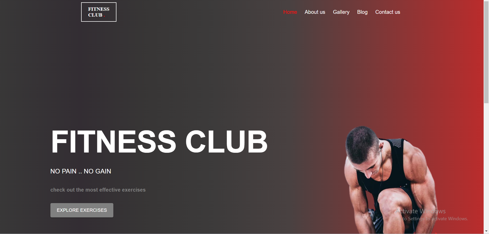

<h2><strong>Gym Hive</strong> application</h2>
<br >

<hr >

<h4>Description</h4>
This application helps users find all kinds of body building exercises to practice with,
from deadlift, goblet squat to corckscrew all available in one place.
<br >

<h4>Installation</h4>
Start by cloning the repo:

```
git clone https://github.com/bismarkboateng/gym_hive.git
npm install --legacy-peer-deps
npm start
```

your app will start running on port 3000 for most users, <br >
Copy and past the link in the terminal into your preferred browser
